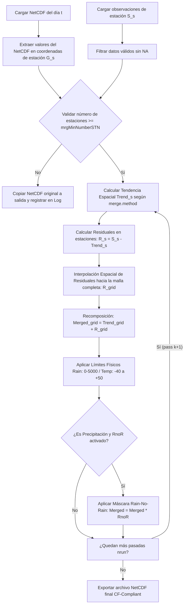

# 02. Fundamentos del Proceso de Fusión (Merging)

## 1. Justificación y Marco Conceptual

Las observaciones meteorológicas en superficie (estaciones) proporcionan mediciones directas y precisas, pero presentan limitaciones críticas:
- Cobertura espacial dispersa e irregular.
- Zonas de difícil acceso (montañas, selvas, áreas rurales) desprovistas de sensores.
- Vacíos temporales por fallas en el registro o transmisión.

Por otro lado, los productos grillados (estimaciones satelitales de precipitación como CHIRPS/IMERG y reanálisis meteorológicos como ERA5/MERRA-2) ofrecen:
- Cobertura espacial completa y homogénea.
- Continuidad temporal sin interrupciones.
- Sin embargo, sufren de **sesgos sistemáticos** y dificultades para capturar extremos locales.

El proceso de **Merging** (Fusión de Datos) combina ambas fuentes para producir un conjunto de datos grillado que:
1. Preserve la exactitud de las estaciones en sus ubicaciones reales.
2. Utilice el patrón espacial del proxy satelital/reanálisis para interpolar en las zonas no observadas.

---

## 2. Algoritmo General de Merging en CDT

El pipeline de ejecución en `R/cdtMerging_functions.R` sigue una secuencia rigurosa:



---

## 3. Métodos de Fusión (`merge.method`)

### A. Simple Bias Adjustment (`"SBA"`)
Es el método más directo y robusto cuando la densidad de estaciones es baja o la relación con variables topográficas es compleja.

1. **Tendencia espacial:** Es directamente el campo del NetCDF original:
   $$\text{Trend}(s) = G(s)$$
2. **Residual en las estaciones:**
   $$R(s_i) = S(s_i) - G(s_i)$$
3. **Interpolación:** Se interpola $R(s_i)$ sobre la malla para obtener $\hat{R}(s)$.
4. **Campo fusionado:**
   $$M(s) = G(s) + \hat{R}(s)$$

---

### B. Regression Kriging (`"RK"`)
Combina un modelo de regresión lineal multivariado (mediante un Modelo Lineal Generalizado - GLM con distribución Gaussiana) para modelar la tendencia espacial en función del proxy y variables auxiliares del terreno (DEM, pendiente, orientación, latitud, longitud), seguido de la interpolación de los residuales del modelo.

1. **Fórmula del GLM:**
   $$S(s_i) = \beta_0 + \beta_1 G(s_i) + \sum_{k=1}^{p} \beta_{k+1} X_k(s_i) + \varepsilon(s_i)$$
   donde $X_k$ representa variables auxiliares:
   - `dem`: Elevación del Modelo Digital de Elevación (m).
   - `slope`: Pendiente calculada del DEM.
   - `aspect`: Orientación calculada del DEM.
   - `lon`: Longitud geográfica.
   - `lat`: Latitud geográfica.

2. **Tendencia en toda la malla:**
   $$\text{Trend}(s) = \hat{\beta}_0 + \hat{\beta}_1 G(s) + \sum_{k=1}^{p} \hat{\beta}_{k+1} X_k(s)$$

3. **Residuales en las estaciones:**
   $$R(s_i) = S(s_i) - \text{Trend}(s_i)$$

4. **Interpolación de residuales:** $\hat{R}(s)$ mediante Kriging Ordinario o IDW.

5. **Campo fusionado final:**
   $$M(s) = \text{Trend}(s) + \hat{R}(s)$$

> [!IMPORTANT]
> **Condiciones de Seguridad y Fallback en RK:**
> En CDT, si el GLM presenta:
> - Varianza nula en estaciones o satélite ($\sigma^2 < 10^{-7}$).
> - Coeficiente negativo $\beta_1 < 0$ (implicaría una relación inversa no física entre el satélite y las estaciones).
> - Número de estaciones menor a `rkMinNumberSTN` (def: 8).
> 
> CDT **cambia automáticamente a SBA** para esa fecha concreta, dejando constancia en el log.

---

### C. Esquema de Cressman (`"CSc"`)
Es un método de corrección sucesiva ampliamente usado en análisis objetivo meteorológico.

- En cada iteración $k$, el valor en cada celda $j$ se ajusta mediante una suma ponderada de las diferencias entre las estaciones y el campo base:
  $$\Delta M_j = \frac{\sum_{i=1}^{N} W_{ij} \left(S_i - M_i^{(k-1)}\right)}{\sum_{i=1}^{N} W_{ij}}$$
- **Función de peso de Cressman:**
  $$W_{ij} = \begin{cases} \dfrac{R^2 - d_{ij}^2}{R^2 + d_{ij}^2} & \text{si } d_{ij} < R \\ 0 & \text{si } d_{ij} \ge R \end{cases}$$
  donde $d_{ij}$ es la distancia entre la estación $i$ y la celda $j$, y $R$ es el radio de influencia.

---

### D. Esquema de Barnes (`"BSc"`)
Similar a Cressman, pero utiliza una función de decaimiento gaussiana continua:
- **Función de peso de Barnes:**
  $$W_{ij} = \exp\left( - \frac{d_{ij}^2}{4 c} \right)$$
  donde $c$ es un parámetro de escala dependiente del radio de influencia y de la densidad media de estaciones. Ofrece transiciones espaciales más suaves que el esquema de Cressman.

---

## 4. Esquema Multi-Pasada Anidado (`nrun` y `pass`)

CDT implementa un enfoque de **refinamiento iterativo multiescala**:

```r
merge.method = list(
  method = "SBA", 
  nrun = 3, 
  pass = c(1.0, 0.75, 0.50)
)
```

1. **Pasada 1 (`pass = 1.0`):** Se utiliza el radio de búsqueda completo (`maxdist`) y el número total de vecinos (`nmin`, `nmax`). Corrige patrones de sesgo de escala regional o sinóptica.
2. **Pasada 2 (`pass = 0.75`):** Se reduce el radio de influencia al 75%. Corrige desviaciones a mesoescala.
3. **Pasada 3 (`pass = 0.50`):** Se reduce el radio al 50%. Ajusta microclimas locales inmediatos a cada estación.

En cada pasada $k$, el campo $M^{(k)}$ generado es la base sobre la que se reevalúan los residuales en el paso $k+1$.
