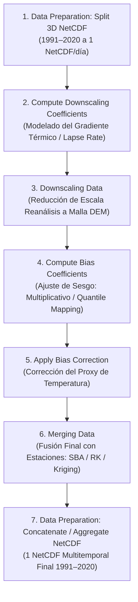
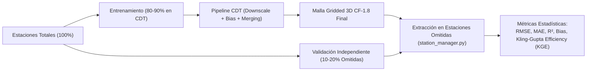

# 07. Flujo Completo de Temperatura (CHIRTS / Reanálisis) y Diseño Experimental

Este documento detalla exhaustivamente la cadena de procesamiento de **Temperatura** en CDT, desde la preparación de archivos NetCDF 3D multitemporales (1991–2020) hasta la fusión final, explicando el fundamento climatológico/estadístico de cada menú y la **matriz de experimentos parametrizables** para investigación y publicación científica.

---

## 1. Cadena de Procesamiento en el Menú de CDT



---

## 2. Detalle Paso a Paso: Menús, Estadística y Climatología

### Paso 1: Data Preparation > Split 3D NetCDF Files
- **Qué hace el software:** Lee el archivo NetCDF original que contiene las 3 dimensiones $(X, Y, \text{Tiempo})$ para el periodo 1991–2020, decodifica el calendario (`gregorian`, `noleap`, `365_day`, `julian`) y genera un archivo NetCDF individual 2D $(Lon, Lat)$ por cada día/mes con nomenclatura homogénea (`tmax_19910101.nc`).
- **Sentido físico/computacional:** Permite el procesamiento paralelo masivo, modularidad temporal y acceso aleatorio eficiente sin cargar terabytes en la memoria RAM.

---

### Paso 2: Gridding > Downscaling Reanalysis > Compute Downscaling Coefficients
- **Ruta de código:** [`R/cdtTemp_DownscalingCoef_Procs.R`](file:///d:/Workspace/CDT-8.0/R/cdtTemp_DownscalingCoef_Procs.R)
- **Fundamento Climatológico:** La temperatura disminuye sistemáticamente con la altitud debido a la descompresión adiabática del aire (*Environmental Lapse Rate*, típicamente entre $-5.0\ ^\circ\text{C}$ y $-6.5\ ^\circ\text{C}$ por cada $1000\text{ m}$). Además, la insolación varía según la pendiente (*slope*) y la orientación de las laderas (*aspect*).
- **Fundamento Estadístico:** Ajusta un Modelo Lineal Generalizado (GLM) para cada mes del año ($m = 1, \dots, 12$) correlacionando la temperatura observada en las estaciones con la topografía:
  
  $$\text{Temp}_m(s) = \beta_{0,m} + \beta_{1,m} \cdot \text{DEM}(s) + \beta_{2,m} \cdot \text{Slope}(s) + \beta_{3,m} \cdot \text{Aspect}(s) + \text{Polinomio}(\text{Lon}, \text{Lat})$$

- **Salida generada:** Archivos `STN_DEM_GLM_COEF.txt` y `STN_DEM_GLM_COEF.rds` con la matriz de 12 filas (una por mes) y los coeficientes ajustados $\beta$.

---

### Paso 3: Gridding > Downscaling Reanalysis > Downscaling Data
- **Ruta de código:** [`R/cdtTemp_DownscalingReanal_Procs.R`](file:///d:/Workspace/CDT-8.0/R/cdtTemp_DownscalingReanal_Procs.R)
- **Fundamento Climatológico:** Los reanálisis o CHIRTS nativos suelen tener resoluciones espaciales gruesas ($0.25^\circ \approx 28\text{ km}$ o $0.05^\circ$). Este paso transfiere la variabilidad orográfica de alta resolución del DEM ($90\text{ m}$ o $1\text{ km}$) al campo térmico grueso.
- **Fundamento Estadístico:**
  1. Agrega el DEM fino a la resolución gruesa del reanálisis: $\text{DEM}_{\text{coarse}}$.
  2. Predice la temperatura gruesa esperada por topografía: $\hat{T}_{\text{coarse}} = f_m(\text{DEM}_{\text{coarse}})$.
  3. Extrae la anomalía climática sinóptica / residual grueso:
     $$R_{\text{coarse}} = T_{\text{reanalysis}} - \hat{T}_{\text{coarse}}$$
  4. Interpola el residual $R_{\text{coarse}}$ a la cuadrícula fina mediante **Bilineal**, **IDW** o **Kriging**.
  5. Reconstruye la temperatura desescalada de alta resolución:
     $$T_{\text{downscaled}}(s_{\text{fino}}) = f_m(\text{DEM}_{\text{fino}}) + \hat{R}_{\text{fino}}(s_{\text{fino}})$$
- **Salida generada:** NetCDFs diarios de temperatura desescalada con la resolución del DEM.

---

### Paso 4: Gridding > Bias Correction > Compute Bias Coefficients (Temperature)
- **Ruta de código:** [`R/cdtBias_functions.R`](file:///d:/Workspace/CDT-8.0/R/cdtBias_functions.R#L211-L320), [`R/cdtBias_Options_functions.R`](file:///d:/Workspace/CDT-8.0/R/cdtBias_Options_functions.R)
- **Fundamento Climatológico:** El reanálisis/satélite desescalado puede tener sesgos sistemáticos debidos a errores en la parametrización de la capa límite, albedo del suelo o nubosidad.
- **Fundamento Estadístico:** Modela la función de transferencia entre estaciones y reanálisis:
  1. **Método Multiplicativo Variable (`"mbvar"` / `"mbmon"`):**
     Calcula el factor de corrección $B_i = \frac{\text{Media}(S_i)}{\text{Media}(G_i)}$ mensual o con ventana móvil de $\pm 5$ días para capturar el ciclo anual continuo.
  2. **Quantile Mapping Paramétrico (`"qmdist"`):**
     Ajusta funciones de densidad de probabilidad acumulada teóricas (CDF):
     - Distribución Normal (`"norm"`): $\mu, \sigma$
     - Log-Normal (`"lnorm"`): $\mu_{\ln}, \sigma_{\ln}$
     - Skew-Normal (`"snorm"`): Asimetría térmica $\mu, \sigma, \xi$
     - Gumbel (`"gumbel"`): Extremos térmicos (olas de calor).
  3. **Quantile Mapping Empírico (`"qmecdf"`):**
     Ajusta directamente las distribuciones empíricas sin asumir una forma paramétrica.
- **Salida generada:** Coeficientes de distribución o mapas de factores de sesgo guardados en disco.

---

### Paso 5: Gridding > Bias Correction > Apply Bias Correction
- **Fundamento Estadístico:** Para cada día $t$, transforma el valor del pixel $x$ mediante la función de cuantiles inversos:
  $$\hat{T}_{\text{corrected}}(s) = F_{\text{stn}}^{-1}\left( F_{\text{proxy}}(T_{\text{downscaled}}(s)) \right)$$
- **Salida generada:** NetCDFs diarios ajustados por sesgo, preservando la media y los cuantiles observados por las estaciones.

---

### Paso 6: Gridding > Merging Climate Data > Temperature Data
- **Ruta de código:** [`R/cdtMerging_Temp_Cmd.R`](file:///d:/Workspace/CDT-8.0/R/cdtMerging_Temp_Cmd.R), [`R/cdtMerging_functions.R`](file:///d:/Workspace/CDT-8.0/R/cdtMerging_functions.R)
- **Fundamento Estadístico:** Ajusta los residuales puntuales finales entre las estaciones y el producto corregido mediante:
  - **Regression Kriging (RK):** Ajusta un GLM dinámico fecha a fecha con covariables espaciales (DEM, Slope, Lon, Lat).
  - **Ordinary Kriging (OKR) / IDW:** Interpola la estructura espacial de los residuales y la adiciona al campo corregido.
  - **Límites físicos:** Clampeo a $[-40\ ^\circ\text{C}, +50\ ^\circ\text{C}]$.

---

## 3. Matriz de Hiperparámetros y Espacio de Búsqueda Experimental

Para una investigación publicable, el objetivo es determinar qué combinación de preprocesamiento, downscaling, corrección de sesgo y fusión produce el menor RMSE, MAE y mayor $R^2$ en validación cruzada.

### Tabla de Parámetros Manipulables para Experimentos

| Etapa | Parámetro en CDT | Opciones / Rango de Variación | Justificación Científica |
| :--- | :--- | :--- | :--- |
| **Downscaling: Lapse Rate** | `useClimato` | `TRUE` (climatológico mensual) vs `FALSE` (serie completa continua) | Evalúa si el gradiente térmico es estacional fijo o dinámico. |
| **Downscaling: Topografía** | `aspect.slope` / `polynomial` | - Solo Elevación (`v ~ z`)<br>- Elevación + Pendiente + Aspecto (`v ~ s + a + z`)<br>- Polinomio espacial Grado 1 o 2 (`order = 1, 2`) | Determina el impacto de la radiación según la orientación de laderas. |
| **Downscaling: Estandarización** | `standardize` | `TRUE` vs `FALSE` | Estabilidad numérica en áreas montañosas de gran desnivel. |
| **Downscaling: Residuales** | `interp.method` | `"blin"` (Bilineal), `"idw"`, `"okr"` (Kriging) | Evalúa cómo se propaga la anomalía sinóptica a la malla fina. |
| **Bias: Método** | `bias.method` | `"mbmon"`, `"mbvar"` ($\pm 5$ días), `"qmdist"`, `"qmecdf"` | Compara ajuste lineal simple vs mapeo no lineal de cuantiles. |
| **Bias: Distribución QM** | `distr.name` (en `qmdist`) | `"norm"`, `"lnorm"`, `"snorm"`, `"gumbel"` | Evalúa el ajuste en olas de frío/calor y asimetría térmica. |
| **Bias: Función Central** | `mulBiasFunction` | `"mean"` vs `"median"` | Robustez frente a valores atípicos (*outliers*). |
| **Merging: Método** | `merge.method$method` | `"SBA"`, `"RK"`, `"BSc"` (Barnes), `"CSc"` (Cressman) | Determina si la regresión espacial supera al ajuste aditivo simple. |
| **Merging: Pasadas** | `nrun` y `pass` | - 1 pasada: `pass = c(1)`<br>- 2 pasadas: `pass = c(1, 0.5)`<br>- 3 pasadas: `pass = c(1, 0.75, 0.5)` | Refinamiento multiescala: regional vs local. |
| **Merging: Radio Búsqueda** | `interp.method$maxdist` | $1.5^\circ, 2.5^\circ, 3.5^\circ, 5.0^\circ$ | Rango de correlación espacial térmica. |
| **Merging: Vecindad** | `nmin` / `nmax` | $(4, 12)$, $(8, 16)$, $(10, 30)$ | Densidad y suavidad en la interpolación de residuales. |
| **Merging: Kriging Variograma**| `vgm.model` | `"Sph"`, `"Exp"`, `"Gau"`, `"Pen"` | Forma de la autocorrelación espacial de residuales. |
| **Merging: Soporte de Celda** | `use.block` | `TRUE` (Block Kriging) vs `FALSE` (Point Kriging) | Corrección del error de cambio de soporte espacial. |

---

## 4. Partición Experimental: Dinámicas Físicas de $T_{max}$ vs $T_{min}$

La física atmosférica exige modelar y evaluar de manera independiente los extremos diurnos y nocturnos:

1. **Temperatura Máxima ($T_{max}$, Suite `EXP-TX01` a `EXP-TX08`):**
   - Dominada por la radiación solar directa, el albedo, la pendiente e inclinación (*slope*) y la orientación de la ladera (*aspect*).
   - Extremos modelados mediante distribución **Gumbel** para olas de calor en valles áridos y zonas deprimidas (Valle de Azua, Hoya de Enriquillo, Golfo de Fonseca).
   - Covariables espaciales críticas en Regression Kriging: DEM + Pendiente + Aspecto + Coordenadas.

2. **Temperatura Mínima ($T_{min}$, Suite `EXP-TN01` a `EXP-TN08`):**
   - Dominada por el enfriamiento radiativo nocturno, el desacople de la capa límite superficial, drenaje catabático de aire denso e **inversiones térmicas** en valles altos cerrados (Constanza, Valle Nuevo, Altiplano Occidental de Guatemala).
   - Frentes fríos continentales (*Nortes*) modelados mediante distribución **Skew-Normal** para capturar caídas térmicas bruscas asimétricas.
   - Interpolación de residuales mediante **NN-3D ($\Delta z$)** para impedir la transferencia espuria de calor desde llanuras costeras hacia valles altos.

---

## 5. Ejecución Automatizada con Python Launcher

Las dos suites de temperatura se ejecutan de manera directa y desatendida mediante:

```bash
# Ejecutar suite completa de Temperatura Máxima (8 experimentos)
python launcher/experiment_runner.py --suite tmax

# Ejecutar suite completa de Temperatura Mínima (8 experimentos)
python launcher/experiment_runner.py --suite tmin

# Ejecutar un experimento individual de Tmax (ej. insolación y radiación solar)
python launcher/experiment_runner.py --config config/experiments_tmax/EXP_TX08_RK_Aspect_Solar_Insolation.yaml

# Ejecutar un experimento individual de Tmin (ej. inversiones térmicas en valles)
python launcher/experiment_runner.py --config config/experiments_tmin/EXP_TN04_RK_NN3D_Inversion_Valleys.yaml
```

### Esquema de Validación Cruzada Independiente (Holdout)


