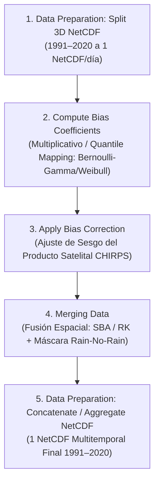

# 08. Flujo Completo de Precipitación (CHIRPS) y Diseño Experimental

Este documento detalla la cadena de procesamiento completa de **Precipitación** en CDT, desde la preparación de archivos NetCDF 3D (1991–2020) hasta la fusión final, explicando el fundamento climatológico/estadístico de cada menú y la **matriz de experimentos parametrizables** para investigación y publicación científica.

---

## 1. Cadena de Procesamiento en el Menú de CDT



> **Nota Metodológica:** A diferencia de la temperatura, la precipitación **no utiliza un paso previo de downscaling por gradiente térmico estático**, ya que la lluvia no presenta una relación lineal simple con la elevación (los procesos convectivos y la orografía inducen sombras de lluvia y saturación no lineales). El efecto orográfico se incorpora directamente en el paso de **Merging** mediante **Regression Kriging (RK)**.

---

## 2. Detalle Paso a Paso: Menús, Estadística y Climatología

### Paso 1: Data Preparation > Split 3D NetCDF Files
- **Qué hace el software:** Separa el cubo tridimensional $(X, Y, \text{Tiempo})$ de CHIRPS (1991–2020) en archivos diarios individuales (`chirps_19910101.nc`).
- **Sentido físico/computacional:** Homogeneiza el acceso espacial y habilita el procesamiento en paralelo de 30 años de registros diarios (~10,950 archivos).

---

### Paso 2: Gridding > Bias Correction > Compute Bias Coefficients (Rainfall)
- **Ruta de código:** [`R/cdtBias_functions.R`](file:///d:/Workspace/CDT-8.0/R/cdtBias_functions.R#L1-L188), [`R/cdtBias_Options_functions.R`](file:///d:/Workspace/CDT-8.0/R/cdtBias_Options_functions.R)
- **Fundamento Climatológico:** Los sensores infrarrojos y de microondas pasivas de los satélites tienden a:
  1. Subestimar eventos de lluvia extrema convectiva localizada.
  2. Sobreestimar la frecuencia de lloviznas leves en zonas semiáridas o nubosidad fría sin precipitación en superficie (*virga*).
- **Fundamento Estadístico:** Ajusta la distribución de probabilidad acumulada (CDF) satelital a la observada en las estaciones mediante:

#### A. Métodos Multiplicativos
- **`"mbmon"`:** Factor de sesgo medio mensual $B_m = \frac{\bar{S}_m}{\bar{G}_m}$.
- **`"mbvar"`:** Factor con ventana móvil de $\pm 5$ días para evitar discontinuidades entre el último día del mes y el primero del siguiente.
- **Función central (`mulBiasFunction`):**
  - `"mean"`: Preserva el volumen total acumulado de agua.
  - `"median"`: Inmune a tormentas extremas atípicas.
- **Límites de seguridad en CDT:** $B \in [0.01, 3.0]$.

#### B. Quantile Mapping Paramétrico para Variables Mixtas Cero-Continuas (`"qmdist"`)
Combina una distribución discreta de Bernoulli para la probabilidad de ocurrencia de lluvia ($P(R > \text{wet})$) con una distribución continua para la intensidad de la precipitación:

1. **Bernoulli-Gamma (`"berngamma"`):** Estándar climatológico para precipitación diaria.
   $$f(x) = (1 - p)\delta(x) + p \cdot \frac{1}{\Gamma(\alpha)\beta^\alpha} x^{\alpha - 1} e^{-x/\beta}, \quad x > 0$$
   donde $p$ es la probabilidad de día lluvioso, $\alpha$ es el parámetro de forma y $\beta$ de escala.
2. **Bernoulli-Weibull (`"bernweibull"`):** Excelente comportamiento en eventos de precipitación severa y colas pesadas.
3. **Bernoulli-Exponential (`"bernexp"`):** Modelo simplificado de 1 parámetro de intensidad.
4. **Bernoulli-Log-Normal (`"bernlnorm"`):** Alternativa para distribuciones altamente asimétricas.

#### C. Quantile Mapping Empírico (`"qmecdf"`)
Ajusta la curva acumulada empírica punto a punto sin parametrización analítica previa.

---

### Paso 3: Gridding > Bias Correction > Apply Bias Correction
- **Fundamento Estadístico:** Mapea cada valor satelital diario $x$ a la probabilidad $P_{\text{sat}}(x)$ y halla el cuantil correspondiente en la distribución de las estaciones:
  $$x_{\text{corregido}} = F_{\text{estación}}^{-1}\left( F_{\text{sat}}(x) \right)$$
- **Salida generada:** NetCDFs de CHIRPS corregidos por sesgo en volumen y distribución de frecuencias.

---

### Paso 4: Gridding > Merging Climate Data > Rainfall Data
- **Ruta de código:** [`R/cdtMerging_Precip_Cmd.R`](file:///d:/Workspace/CDT-8.0/R/cdtMerging_Precip_Cmd.R), [`R/cdtMerging_functions.R`](file:///d:/Workspace/CDT-8.0/R/cdtMerging_functions.R)
- **Fundamento Estadístico:** Ajusta los residuales diarios finales preservando la correlación espacial:
  1. **Método de Fusión:**
     - **SBA (*Simple Bias Adjustment*):** Adiciona los residuales espaciales al producto satelital ajustado.
     - **RK (*Regression Kriging*):** Modela la precipitación en función de CHIRPS + DEM + Pendiente + Lat/Lon mediante GLM.
  2. **Máscara Rain-No-Rain (`RnoR`):**
     - Aplica regresión logística espacial (`"logit"`) con umbral `wet` ($1.0\text{ mm}$).
     - Evalúa la función de corte de rampa suave `RnoRCutOff = 3` ($0$ si $P < 0.25$, $P$ si $0.25 \le P < 0.75$, $1$ si $P \geq 0.75$).
     - Aplica suavizado espacial con `RnoRSmoothingPixels = 2`.
     - Multiplica el campo fusionado por la máscara: $\text{Rain}_{\text{final}} = \text{Rain}_{\text{mrg}} \times \text{Mask}_{\text{rnor}}$.
  3. **Límites físicos:** Clampeo estricto a $[0, 5000]\text{ mm}$.

---

## 3. Matriz de Hiperparámetros y Espacio de Búsqueda Experimental

Para un estudio comparativo o artículo de investigación, la siguiente matriz resume todos los factores a explorar:

| Etapa | Parámetro en CDT | Opciones / Rango de Variación | Justificación Científica |
| :--- | :--- | :--- | :--- |
| **Bias: Método General** | `bias.method` | `"mbmon"`, `"mbvar"`, `"qmdist"`, `"qmecdf"` | Comparación entre corrección lineal media vs mapeo de cuantiles distribucionales. |
| **Bias: Distribución QM** | `distr.name` | `"berngamma"`, `"bernweibull"`, `"bernlnorm"`, `"bernexp"` | Identificación de la ley de probabilidad teórica que mejor modela las lluvias de la región. |
| **Bias: Umbral Día Lluvioso** | `qmdistRainyDayThres` | $0.1\text{ mm}$, $0.5\text{ mm}$, $1.0\text{ mm}$, $2.0\text{ mm}$ | Sensibilidad a la definición de lluvia efectiva vs trazas / rocío. |
| **Bias: Función Central** | `mulBiasFunction` | `"mean"` vs `"median"` | Preservación de masa total vs robustez estadística ante tormentas excepcionales. |
| **Bias: Malla Gruesa de Fondo**| `addCoarseGrid` | `TRUE` vs `FALSE` (`resCoarseGrid = 0.5^\circ, 0.75^\circ`) | Estabilidad numérica del sesgo en zonas oceánicas o fronteras sin estaciones. |
| **Merging: Método** | `merge.method$method` | `"SBA"`, `"RK"`, `"CSc"` (Cressman), `"BSc"` (Barnes) | Comparación de ajuste aditivo simple vs modelos orográficos multivariados. |
| **Merging: Covariables RK** | `auxvar` | - Solo DEM<br>- DEM + Slope + Aspect<br>- DEM + Coordenadas (Lon, Lat) | Impacto de la geometría del relieve y sombras de lluvia en la precipitación. |
| **Merging: Pasadas** | `nrun` y `pass` | - 1 pasada: `pass = c(1)`<br>- 2 pasadas: `pass = c(1, 0.5)`<br>- 3 pasadas: `pass = c(1, 0.75, 0.5)` | Corrección multiescala de patrones convectivos vs estratiformes. |
| **Merging: Radio Búsqueda** | `interp.method$maxdist` | $0.75^\circ, 1.25^\circ, 1.75^\circ, 2.5^\circ$ | Rango de decorrelación espacial de tormentas en la cuenca. |
| **Merging: Vecindad** | `nmin` / `nmax` | $(4, 12)$, $(6, 16)$, $(8, 24)$ | Densidad local requerida para no interpolar ruido. |
| **Merging: Kriging Variograma**| `vgm.model` | `"Sph"`, `"Exp"`, `"Gau"`, `"Pen"` | Estructura de covarianza espacial de los residuales pluviales. |
| **Merging: Soporte de Celda** | `use.block` | `TRUE` (Block Kriging) vs `FALSE` | Ajuste de escala puntual ($0\text{ m}$) a pixel satelital ($5\text{ km}$). |
| **RnoR: Modelo** | `RnoRModel` | `"logit"` (Regresión Logística) vs `"additive"` | Modelado probabilístico riguroso vs interpolación continua acotada. |
| **RnoR: Función de Corte** | `RnoRCutOff` | `1` (Corte duro 0.5), `2` (Lineal >0.1), `3` (Rampa sigmoide) | Balance entre eliminación de lloviznas espurias y preservación de lluvia ligera real. |
| **RnoR: Suavizado** | `smooth` y `RnoRSmoothingPixels` | `smooth = TRUE/FALSE`, pixels = $1, 2, 3$ | Continuidad en los bordes de frentes lluviosos. |

---

## 4. Métricas de Evaluación para la Publicación Científica

A diferencia de las variables continuas térmicas, la evaluación rigurosa de precipitación exige **dos categorías de métricas**:

### A. Métricas de Intensidad y Ajuste Volumétrico
- **RMSE (Root Mean Square Error):** Sensible a errores en lluvias intensas.
- **MAE (Mean Absolute Error):** Error medio representativo.
- **KGE (Kling-Gupta Efficiency):** Descompone el error en correlación ($r$), sesgo ($\beta$) y variabilidad ($\gamma$).
- **PBIAS (Percent Bias):** Desviación porcentual del volumen total acumulado anual/estacional.

### B. Métricas Categóricas de Detección (Matriz de Contingencia Cero/Lluvia)
Basadas en eventos observados vs estimados con umbral $\ge 1.0\text{ mm}$:

| Métrica | Fórmula | Interpretación Óptima |
| :--- | :---: | :---: |
| **POD (Probability of Detection)** | $\frac{\text{Hits}}{\text{Hits} + \text{Misses}}$ | $1.0$ (Captura todos los días lluviosos) |
| **FAR (False Alarm Ratio)** | $\frac{\text{False Alarms}}{\text{Hits} + \text{False Alarms}}$ | $0.0$ (Sin falsas lloviznas inventadas) |
| **FBI (Frequency Bias Index)** | $\frac{\text{Hits} + \text{False Alarms}}{\text{Hits} + \text{Misses}}$ | $1.0$ (Frecuencia idéntica a la realidad) |
| **ETS (Equitable Threat Score)** | $\frac{\text{Hits} - \text{Hits}_{\text{random}}}{\text{Hits} + \text{Misses} + \text{False Alarms} - \text{Hits}_{\text{random}}}$ | $1.0$ (Habilidad neta sobre el azar) |
| **HSS (Heidke Skill Score)** | Medida normalizada de acierto categórico | $1.0$ |

---

## 5. Matriz de Experimentos Pluviales y Ejecución con Python Launcher

La suite completa de 10 experimentos de precipitación está implementada en [`config/experiments_rainfall/`](file:///d:/Workspace/CDT-8.0/config/experiments_rainfall) y se ejecuta con:

```bash
# Ejecutar suite completa de Precipitación (10 experimentos, ~6 horas)
python launcher/experiment_runner.py --suite rainfall

# Ejecutar un experimento individual (ej. Regression Kriging Orográfico + Weibull)
python launcher/experiment_runner.py --config config/experiments_rainfall/EXP_R05_RK_Topography_BernoulliWeibull.yaml
```

### Resumen de la Suite de Precipitación (10 Experimentos):
1. **`EXP-R01`:** Línea Base Control (`mbvar` + IDW, SBA 1 pasada, sin RnoR).
2. **`EXP-R02`:** Impacto RnoR en Zonas Semiáridas (`mbvar` + IDW, SBA 3 pasadas, RnoR Logit CutOff=3).
3. **`EXP-R03`:** Distribución Estándar (QM Bernoulli-Gamma + OKR, SBA 3 pasadas).
4. **`EXP-R04`:** Extremos Ciclónicos y Huracanes (QM Bernoulli-Weibull + OKR, SBA 3 pasadas).
5. **`EXP-R05`:** Modelo Orográfico Completo (QM Bernoulli-Weibull + OKR, RK con DEM+Slp+Coords).
6. **`EXP-R06`:** Costero e Insular (Barnes Scheme + NN-3D con DEM).
7. **`EXP-R07`:** Convección Local de Mesoescala (Cressman Scheme en 4 pasadas).
8. **`EXP-R08`:** Terreno Escarpado y Red Dispersa (Interpolación Local de Shepard).
9. **`EXP-R09`:** Geometría Esférica Transfronteriza (Spheremap de Gran Círculo).
10. **`EXP-R10`:** Máxima Complejidad Fisiográfica (RK con DEM + Slope + Aspect + Coordenadas).

