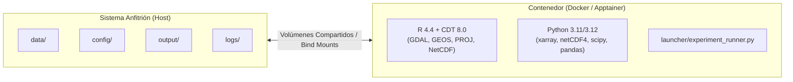

# Guía de Despliegue en Contenedores: Docker, Docker Compose y Apptainer / Singularity

Este documento describe la arquitectura y los procedimientos operativos para ejecutar **Climate Data Tools (CDT v8.0)** y la suite de orquestación en Python utilizando **contenedores inmutables y reproducibles**.

---

## 1. Justificación y Beneficios de los Contenedores en CDT

La integración de contenedores resuelve tres problemas fundamentales en entornos de modelado climático:

1. **Eliminación de Conflictos Geoespaciales C/C++:**  
   Los paquetes espaciales de R (`sf`, `terra`, `sp`, `gstat`, `ncdf4`) requieren bibliotecas C/C++ del sistema con versiones compatibles (**GDAL**, **GEOS**, **PROJ**, **NetCDF-C**, **UDUNITS2**). El contenedor encapsula todo el stack precompilado sobre Debian/Ubuntu LTS.
2. **Reproducibilidad Científica Estricta (Principios FAIR):**  
   Garantiza que cualquier servicio meteorológico o centro de investigación obtenga resultados numéricos idénticos bit a bit, independientemente de si el host es Windows, Linux o macOS.
3. **Ejecución en Supercómputo (HPC) sin Permisos de Root:**  
   Mediante **Apptainer / Singularity**, es posible lanzar lotes masivos de experimentos en clusters gestionados por **SLURM / PBS** sin requerir privilegios de administrador.

---

## 2. Métodos de Despliegue Disponibles



---

## 3. Despliegue con Docker y Docker Compose

### A. Requisitos Previos
* **Docker Engine** (v20.10+) o **Docker Desktop** (en Windows/macOS con backend WSL2).
* **Docker Compose** (v2.0+).

### B. Construcción de la Imagen
```bash
# Construir la imagen localmente (etiqueta cdt-runner:8.0)
docker compose build
```

### C. Verificación del Entorno
```bash
docker compose run --rm cdt-runner python launcher/experiment_runner.py --check-env
```

### D. Ejecución de Experimentos y Suites

```bash
# Ejecutar suite completa de Precipitación (10 Experimentos):
docker compose run --rm cdt-runner python launcher/experiment_runner.py --suite rainfall

# Ejecutar suite de Temperatura Máxima (8 Experimentos):
docker compose run --rm cdt-runner python launcher/experiment_runner.py --suite tmax

# Ejecutar suite de Temperatura Mínima (8 Experimentos):
docker compose run --rm cdt-runner python launcher/experiment_runner.py --suite tmin

# Ejecutar un experimento individual:
docker compose run --rm cdt-runner python launcher/experiment_runner.py --config config/experiments_rainfall/EXP_R07_Rainfall_RK_DEM_Slope.yaml

# Ejecutar el benchmark y generar reporte interactivo HTML:
docker compose run --rm cdt-runner python launcher/experiment_runner.py --suite all --generate-report
```

---

## 4. Despliegue en Clusters de Alto Rendimiento (HPC) con Apptainer / Singularity

En centros de supercómputo donde el demonio de Docker está deshabilitado por seguridad, se utiliza el archivo de definición [`Apptainer.def`](file:///d:/Workspace/CDT-8.0/Apptainer.def).

### A. Construir la Imagen `.sif`
```bash
# Construir imagen SIF (en máquina con permisos o entorno de compilación)
apptainer build cdt_8.0.sif Apptainer.def
```

### B. Ejecución en Servidor HPC / Script de SLURM (`job_cdt.sh`)

```bash
#!/bin/bash
#SBATCH --job-name=CDT_Experiments
#SBATCH --nodes=1
#SBATCH --ntasks=1
#SBATCH --cpus-per-task=10
#SBATCH --mem=32G
#SBATCH --time=36:00:00
#SBATCH --output=logs/slurm_%j.log

# Cargar módulo de Apptainer (según cluster)
module load apptainer

# Ejecución ligando el directorio de trabajo del cluster
apptainer run \
    --bind $(pwd):/workspace \
    --pwd /workspace \
    cdt_8.0.sif \
    --suite all \
    --generate-report
```

---

## 5. Desarrollo Integrado con DevContainers (VS Code / Cursor)

El repositorio incluye la carpeta de configuración [`.devcontainer/`](file:///d:/Workspace/CDT-8.0/.devcontainer/devcontainer.json):

1. Abrir la carpeta raíz del proyecto en **VS Code** o **Cursor**.
2. Presionar `F1` o `Ctrl+Shift+P` y seleccionar: **`Dev Containers: Reopen in Container`**.
3. El editor levantará el contenedor de desarrollo con todas las extensiones de Python, R, resaltado de sintaxis NetCDF/YAML y linters configurados automáticamente.

---

## 6. Matriz Comparativa de Métodos de Instalación

| Característica | 1. Bare Metal / Nativo | 2. Docker / Compose | 3. Apptainer / HPC |
| :--- | :--- | :--- | :--- |
| **Plataformas Soportadas** | Windows (Rtools), Linux nativo | Linux, Windows (WSL2), macOS | Clusters Linux (SLURM, PBS) |
| **Instalación de R y GDAL** | Manual en el sistema anfitrión | **Cero (Preconfigurado en imagen)** | **Cero (Preconfigurado en `.sif`)** |
| **Requiere Permisos Root** | Sí (para librerías de sistema) | Sí (al instalar Docker Engine) | **No (`rootless` en HPC)** |
| **Persistencia de Datos** | Rutas locales directas | Volúmenes montados (`./data`, `./output`) | Bind mounts (`--bind $(pwd):/workspace`) |
| **Caso de Uso Recomendado** | Servidores locales con R preinstalado | Estaciones de trabajo y entornos Cloud | Supercómputo y servidores institucionales |
